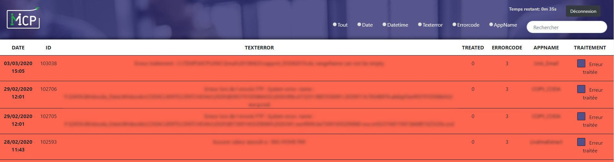

# But
Ce projet a été réalisé pendant mon stage à MCP. Celui-ci a été fais pour MCP, donc le site est privé.
# Concept
Afficher toutes les erreurs ressorties des logiciels internes de MCP. Pouvoir les trier via un filtre et les valider quand elles sont traitées.

Affichage de toutes les erreurs sous forme de tableau

Vous pouvez voir ci-dessus le filtre, le temps restant avant que la page se rafraichisse

Bouton pour pouvoir cocher toutes les erreurs et les traités toutes en un coup
# Langages / librairies utilisés
* HTML
* CSS
* Bootstrap
* PHP
* SQL server
* AJAX
# Réalisations
* Connexion avec un pseudo et mot de passe pour la sécurité
* Afficher les 30 dernières erreurs de la base de donnée
* Effectuer des recherches de 'tout': afficher les 30 premières erreurs même ceux qui sont traités
* Effectuer des recherches de 'date': afficher toutes les erreurs d’une journée
* Effectuer des recherches de 'datetime': afficher les 30 premières erreurs du jour et l’heure choisie + 1 heure après
* Effectuer des recherches de 'texterror': afficher les 30 premières erreurs comportant le texterror saisi
* Effectuer des recherches de 'appName': afficher les 30 premières erreurs comportant le appname saisi
* Quand une erreur est traitée, on peut cocher 'erreur traitée' et valider
* Rafraichir la page toutes les x secondes pour mettre à jour les données et afficher les secondes restantes avant le rafraichissement
